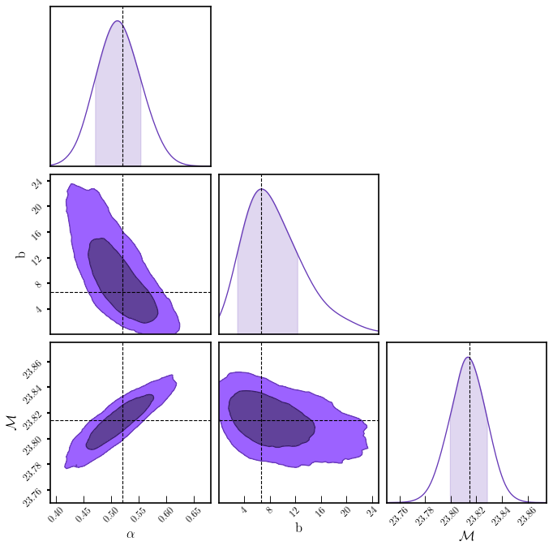

# Observational Constraints on the Deceleration Parameter in the Tilted Frame

This is the repository that contains the corresponding Mathematica and Python files as well as useful comments that reproduce the figures of our work. 

## Abstract
...

## Instructions
### Mathematica Files
Regarding the relevant Mathematica codes, the file `Tilted Cosmology.nb` corresponds to the Mathematica code in order to obtain the results of the maximum likelihood method for all the models described in Table I. The file `Information Criteria.nb` corresponds to the calculations of Table II. The best fit results were obtained with Mathematica 11. 

### Python Files
Regarding the relevant Python codes, ....

## Citing the paper 
If you use any of the above codes or the figures in a published work please cite the following paper:
 *Observational Constraints on the Deceleration Parameter in the Tilted Frame*
 Kerkyra Asvesta, Lavrentios Kazantzidis, Leandros Perivolaropoulos, and Christos Tsagas

Any further questions/comments are welcome.

## Authors List
 Kerkyra Asvesta - <keasvest@auth.gr>
 Lavrentios Kazantzidis - <l.kazantzidis@uoi.gr>
 Leandros Perivolaropoulos - <leandros@uoi.gr>
 Christos Tsagas - <tsagas@astro.auth.gr>
